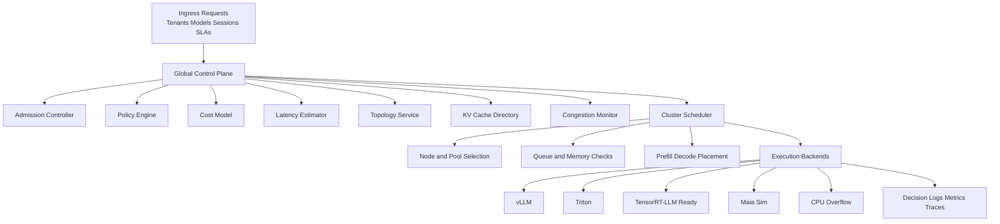

# NimbusMesh-X System Design

## Problem

Cloud inference stacks still optimize in silos. Schedulers see queues. Serving runtimes see KV cache. Cluster managers see capacity. Fabric managers see congestion. NimbusMesh-X exists to unify those views into one control plane that makes better placement decisions for long-context, multi-tenant inference.

## Design Goals

- Lower p95 and p99 latency for long-context and agentic workloads
- Improve cache hit rate without blindly causing fabric hotspots
- Route low-priority traffic to cheaper accelerator pools when safe
- Preserve fairness under hot tenants and mixed SLA classes
- Make every claim benchmarkable and replayable

## Layered Architecture

## Runtime Model

Each request is represented by:

- tenant ID
- model ID
- prompt token length
- generation token length
- SLA class
- session ID
- prefix signature

Each candidate placement is scored on:

- queue delay
- projected prefill latency
- projected decode latency
- cache hit ratio
- topology affinity
- ingress plus fabric cost
- congestion score
- memory headroom
- accelerator cost
- fairness penalty

## Scheduling Flow

1. Generate all cluster and pool candidates.
2. Drop candidates that fail model support, memory headroom, queue, or failure checks.
3. Query the KV cache directory for expected saved tokens and cache hit ratio.
4. Query the topology service for locality affinity and route cost.
5. Estimate latency through the serving backend adapter.
6. Apply a policy:
   - round robin
   - least queue
   - topology greedy
   - cache aware
   - multi objective
   - contextual bandit
7. Place the request onto the chosen pool slot.
8. Log the decision and update metrics and cache state.

## Topology Service

The topology service models:

- cluster gateways
- accelerator pools
- pool-to-gateway fabric cost
- inter-cluster network cost

The current implementation builds a graph from config and computes shortest-path cost. Long-context prompts amplify the benefit of stronger topology tiers like `nvlink-mesh` and `nvlink-ring`.

## KV Cache Directory

The directory tracks reusable prefixes by:

- model
- tenant
- prefix signature
- cluster
- pool

It only exposes cache entries after the originating request has completed. That prevents unrealistic “future cache hit” artifacts in simulation.

## Local Scheduler

The local scheduler keeps the runtime honest by accounting for:

- slot availability
- queue delay
- active memory
- cache-reserved memory

This means the global router can still be wrong under dynamic conditions, but its mistakes are observable and benchmarkable rather than hidden behind optimistic assumptions.

## Learning Policy Path

The repository includes a lightweight contextual bandit as the first online adaptation mode. It updates rewards based on:

- SLA satisfaction
- latency
- cache hit ratio
- cost

This is not presented as “full RL solved.” It is a practical bridge toward future PPO and GNN-based policies.

## Experimental Claims to Prove

NimbusMesh-X should only claim success when a benchmark demonstrates at least one of the following:

- lower p99 latency than least queue or round robin
- higher cache hit ratio than queue-only routing
- fewer SLA misses during congestion or failures
- lower cost per million tokens for best-effort traffic
- better fairness under hot-tenant load

## Near-Term Extensions

- Redis-backed distributed cache metadata
- Ray-driven multi-process simulation
- TensorRT-LLM adapter and live serving harness
- disaggregated prefill and decode scheduling
- MoE expert-locality features
- offline trace replay and imitation learning

